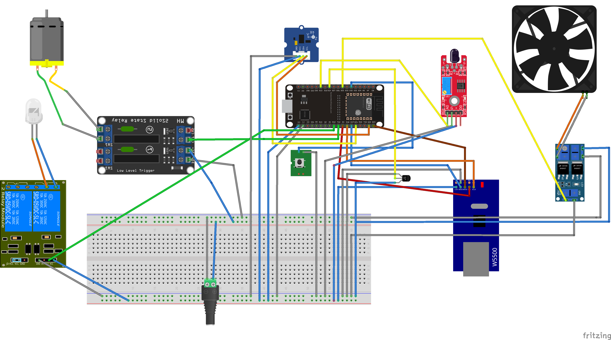

## Блок управления пилетной горелкой АПГ-25 на основе esp32

Данный блок сделан взамен стандартного, который стоит очень дорого и не имеет управления по сети. 

ESP32 имеет встроенныймодуль wifi, но я не использовал его. Мне была принципиальна работа сети по кабелю. Но, если кому-то нужно, такая возможность есть, и в этом случае модуль W5500 можно не покупать.

Делал для своей АПГ-25, но подойдёт на горелки любой мощности.

#### _Компоненты_

| Компонент | Цена\* | Ссылка\*\* |
| --- | --- | --- |
| ESP32 | 334 | [link](https://market.yandex.ru/product--maketnaia-plata-nodemcu-esp32-esp-wroom-32-ch340-type-c-wifi-bluetooth-lua-sverkhnizkoe-energopotreblenie/1790648827?sku=101880910886&uniqueId=58119328&do-waremd5=1HNdoUzQZoufGNtK-6E05Q&nid=61856) |
| Датчик обнаружения пламени LM393, 4-контактный | 364 | [link](https://www.ozon.ru/product/datchik-obnaruzheniya-plameni-lm393-4-kontaktnyy-846693032/?asb=hBiRiZDrNwCDoU7U5QeV0Pm0KUHdelHlmZQXETNRLEw%253D&asb2=aw-6rGzNZhQRzpwiNINKjgid4D3GQ0P4UlEKcmdoBjm0Vx1kkgscBu8M4ftGOWhgeHI1bINY-PZ9cj3KUq3dVw&avtc=1&avte=2&avts=1725123589&keywords=%D0%94%D0%B0%D1%82%D1%87%D0%B8%D0%BA+%D0%BE%D0%B1%D0%BD%D0%B0%D1%80%D1%83%D0%B6%D0%B5%D0%BD%D0%B8%D1%8F+%D0%BF%D0%BB%D0%B0%D0%BC%D0%B5%D0%BD%D0%B8+LM393%2C+4-%D0%BA%D0%BE%D0%BD%D1%82%D0%B0%D0%BA%D1%82%D0%BD%D1%8B%D0%B9) |
| OLED дисплей 0.96" 128x64, I2C | 330 | [link](https://www.ozon.ru/product/oled-displey-0-96-128x64-i2c-goluboy-832377824/) |
| Модуль регулятора напряжения N-MOS | 470 | [link](https://www.ozon.ru/product/regulyator-skorosti-dvigatelya-xy-mos-regulyator-napryazheniya-n-mos-pereklyuchatel-1228912589/) |
| Сетевой модуль W5500 | 420 | [link](https://market.yandex.ru/product--setevoi-modul-w5500-tcp-ip-stm32-ethernet-dlia-arduino-n/1824023690?sku=101968565885&uniqueId=932565&do-waremd5=l6RW3MQS-Dln0jpte7dQYg&nid=61856) |
| Модуль реле твердотельное 12 вольт 2 канала высокоуровневое. | 680 | [link](https://www.ozon.ru/product/passivnyy-komponent-modul-rele-tverdotelnoe-12-volt-2-kanala-vysokourovnevoe-1208143026/) |
| Печатная макетная плата для пайки двухсторонняя 9\*15см / зеленая плата под пайку универсальная | 240 | [link](https://www.ozon.ru/product/pechatnaya-maketnaya-plata-dlya-payki-dvuhstoronnyaya-9-15sm-zelenaya-plata-pod-payku-universalnaya-1067054329/) |
| Штыревые однорядные разъемы на плату МАМА (PBS-40) 40 pin 2.54 мм, 10 штук | 370 | [link](https://www.ozon.ru/product/shtyrevye-odnoryadnye-razemy-na-platu-mama-pbs-40-40-pin-2-54-mm-10-shtuk-pld-razem-dlya-proektov-1051231516/) |
| Клеммная колодка KF235 с пружинным зажимом для пайки на плату 10 контактов | 400 | [link](https://www.ozon.ru/product/klemmnaya-kolodka-kf235-s-pruzhinnym-zazhimom-dlya-payki-na-platu-10-kontaktov-764072916/) |
| Клеммная колодка KF202 с пружинным зажимом для пайки на плату 6 контактов | 400 | [link](https://www.ozon.ru/product/klemmnaya-kolodka-kf202-s-pruzhinnym-zazhimom-dlya-payki-na-platu-6-kontaktov-764413414/?asb=tby0V74ND2o5hfGW%252BpJRGPScawkkOdKy86vDkkyHVbY%253D&asb2=e1GlgWaGzBMgbJze2s-4N4_KQ9pGT57vutAZm60iL8_p1W8YhybogodsTgph1pFd&avtc=1&avte=2&avts=1725124843&keywords=%D0%9A%D0%BB%D0%B5%D0%BC%D0%BC%D0%BD%D0%B0%D1%8F+%D0%BA%D0%BE%D0%BB%D0%BE%D0%B4%D0%BA%D0%B0+KF202+%D1%81+%D0%BF%D1%80%D1%83%D0%B6%D0%B8%D0%BD%D0%BD%D1%8B%D0%BC+%D0%B7%D0%B0%D0%B6%D0%B8%D0%BC%D0%BE%D0%BC+%D0%B4%D0%BB%D1%8F+%D0%BF%D0%B0%D0%B9%D0%BA%D0%B8+%D0%BD%D0%B0+%D0%BF%D0%BB%D0%B0%D1%82%D1%83+7+%D0%BA%D0%BE%D0%BD%D1%82%D0%B0%D0%BA%D1%82%D0%BE%D0%B2) |
| Датчик температуры DS18B20 + Модуль для подключения | 300 | [link](https://www.ozon.ru/product/datchik-temperatury-ds18b20-modul-dlya-podklyucheniya-832438319/) |
| Блок питания 12В 2А | У меня был |   |
| Кнопка | Тоже была | [link](https://www.ozon.ru/product/taktovaya-knopka-dip-6mm-h-6mm-h-5mm-kan0611-0431b-komplekt-10sht-1298579180/?asb=FrKIU8vldZLXNb3YUGktmree2B6OnrtZFifcX5JdYMo%253D&asb2=RV0PnuV4dz6rov_p2IldNqN6CenkD2PfN_WyzEUUpLi4DdRtN5qWcosX4vlPzXEvz7RMKIquM4ONTrmxuFaCaQ&avtc=1&avte=2&avts=1725126256&keywords=arduino+%D0%BA%D0%BD%D0%BE%D0%BF%D0%BA%D0%B0) |
|   |   |   |

##### Итого

|

##### 3908

|   |

*   \* Цены имеют свойство рости, актуально на август 2024.
*   \*\* За актуальностью ссылок следить не буду

#### _Схема_

